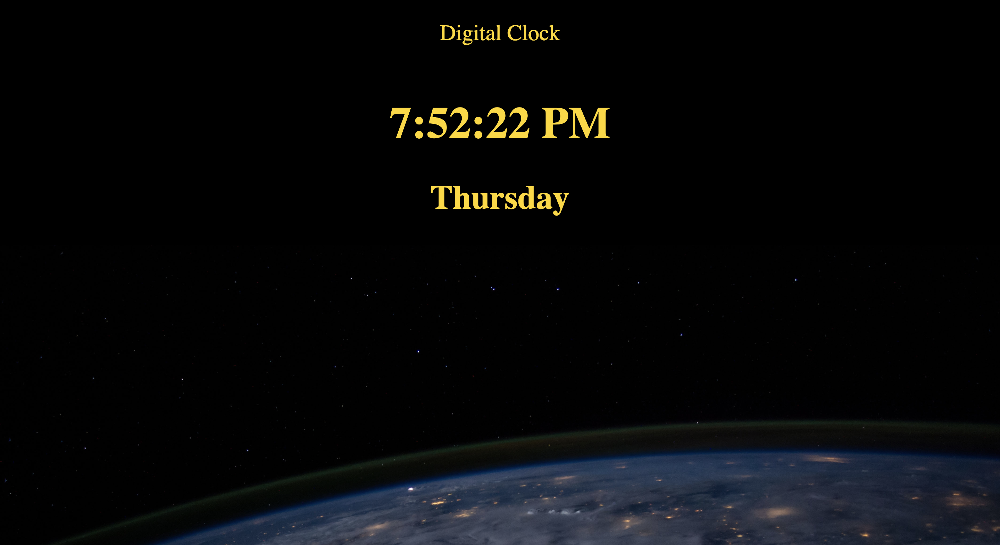

# Clock-app
This application gives you the current time and date and was written entirely in pure Javascript, HTML, and CSS.

click <a href="https://mauroleos.github.io/Clock-app/">here</a> to see website.

# Summary
After learning the basics of Python and Javascript I sought out a mentor to help me expand and refine my abilites. One of the first steps I took was to build this digital clock app using pure Javascript, HTML, and CSS. This app was special to me because it was the first app I finished on own from start-to-finish. I really enjoyed working on this app!

# Author
<strong>Mauro Leos</strong>-<i>Full-Stack Software Developer</i>-<a href="https://www.linkedin.com/in/mauro-leos-b4103a11b/">LinkedIn</a>
